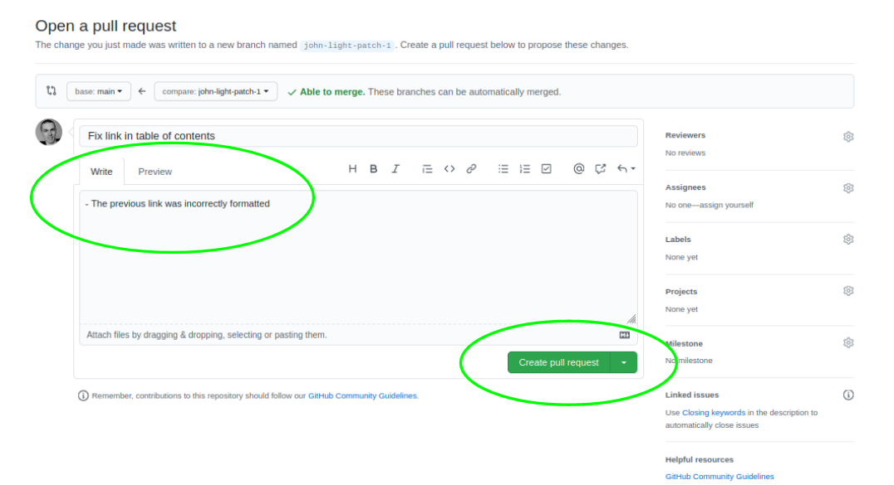

# How to contribute to Decriminalize NH projects

## Create a GitHub account
Visit https://github.com/join and create an account.

GitHub uses Markdown for text formatting. If you don't already know the basics of Markdown, you can learn [here](https://docs.github.com/en/free-pro-team@latest/github/writing-on-github/basic-writing-and-formatting-syntax). An easy way to see how Markdown looks in practice, outside of the examples provided in the previous documentation link, is to click the "Raw" button on any Markdown file on GitHub (denoted by the file extension `.md`). For example, the raw Markdown file for this document can be found [here](https://github.com/decriminalize-nh/contributing/raw/main/README.md). You don't _have_ to use Markdown, but it is nice to know how to in case you need to format text and a [WYSIWYG text editor](https://en.wikipedia.org/wiki/WYSIWYG) isn't available in the text field you are typing in.


## Pick a project you want to contribute to
Take a look through the projects in the [Decriminalize NH organization](https://github.com/decriminalize-nh) and decide which one you want to contribute to. 

Let's say for example you are interested in helping with drug decriminalization.


Click on the name of the project (the blue link that says `decriminalize-drugs`) to enter the project repository (or "repo", for short). 

Click through the files and directories in the repo to familiarize yourself with the contents.


## Create an issue to discuss any ideas/questions/feedback you have
Once you have familiarized yourself with the repo's contents, you can feel confident leaving good feedback. The best way to start a conversation if you have any ideas for improvement, questions, or feedback about the content is to create an issue in the project's repo. Go to the `Issues` tab and click "New issue".


## Create a pull request to add a suggested change
Pull requests are used to suggest changes to a repo on GitHub. These changes can include editing an existing document, creating a new document, or uploading a file.

To edit an existing document, first click on the document you want to edit. Make sure the document is on the "Main" branch, so that you're editing the most recent "main" version of the file you're looking at. Then click the little pencil icon at the top of the document to begin editing.


Once you have finished making your desired edits, scroll down and propose your changes. Put a brief (>50 character) description of your changes in the smaller text field, and optionally add a longer description in the larger text field below that. Your brief description should complete the sentence "If accepted, this proposed change will..." For example, "Fix link in table of contents". Then click "Propose changes".


The next page gives you the option to review your proposed change one more time. If everything looks good, click "Create pull request". 



If your proposed change will take longer than a single sitting, you can also click the arrow next to "Create pull request" and select "Create draft pull request". This will indicate that your changes aren't done yet, and you will come back later to finish your proposed changes. 

Once your proposed changes are ready, you can find your pull request in the `Pull request` tab, click into your pull request, and click "Ready to review".


Now other people who are watching the repo know that your pull request is ready to be reviewed and they can begin leaving comments and suggestions. If one of the repo maintainers thinks your proposed changes are acceptable, then they will merge your pull request and your changes will become part of the main branch of the project.

## Reviewing a pull request
One way that you can help a project on GitHub is by reviewing other people's pull requests. You can do this by visiting the `Pull requests` tab and clicking into any open pull requests that look interesting to you.

Here's an example of what an open pull request looks like:


To review the changes, click on the `Files changed` tab. Here you can see what the previous version of the file being changed looks like on the left (with a red background) and what the proposed changes look like on the right (with a green background).

There are three ways to leave a comment, if you have any questions or feedback for the author:

1. You can comment on the entire pull request by click the "Review changes" button, entering your comment, then clicking "Submit review".


2. You can comment on a single line in the pull request. Scroll to the line that you want to comment on, then click the `+` sign on that line to leave a comment.


3. You can comment on a section made up of multiple lines in the pull request. Scroll down to the first line you want to comment on, click the `+` sign on that line, and drag it down to the last line of the section you want to comment on. 


When using comment methods (2) and (3) you can also directly suggest in-line changes to the pull request. To do this, click the "Insert a suggestion" button in the comment editor. This will add the content that you want to change into the comment box. Simply edit any of the content between the `\```suggestion ```\` text, and then click "Add single comment" to add your suggestion as a single comment, or click "Start a review" if you plan to leave multiple comments as part of your review.


